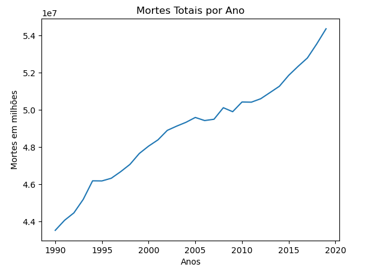
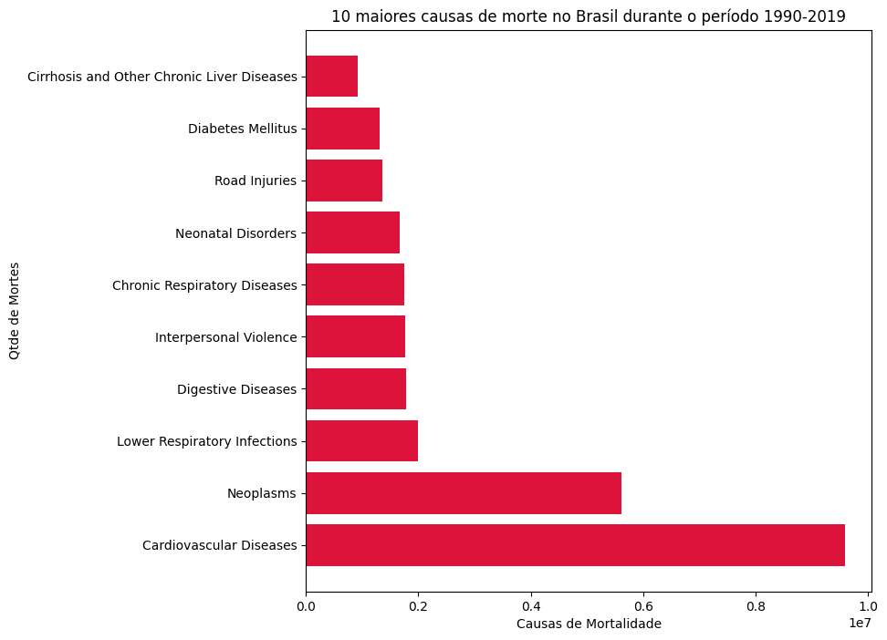

## Causa de morte no mundo

----

No conjunto de dados trabalhados, temos dados históricos de diferentes causas de morte para todas as idades em todo o mundo. O projeto tem o objetivo de realizar algumas análises em relação aos dados gerais e por doença.
Fonte: <https://www.kaggle.com/datasets/iamsouravbanerjee/cause-of-deaths-around-the-world>

### Desenho da solução

### Análises
- [Mortes por Ano](/analise_mortes_por_ano/analise.md/)
- [Países X Doenças](/Paises_X_Doencas/paises_X_doencas.md)

### Notebooks
- [Mortes por ano](/analise_mortes_por_ano/programacao_para_analise.ipynb)
- [Países x Doenças](/Paises_X_Doencas/paises_doencas.ipynb)
- [Campanha consumo excessivo álcool](/alcohol_campain.ipynb)
- [Doenças contagiosas x Doenças não contagiosas](/deaths_contagius.ipynb)
- [Principais doenças de cada ano](/Trabalho_Idade_doencas.ipynb)

### Gráficos

### Mortes por ano
### 

### Países x Doenças
### 
