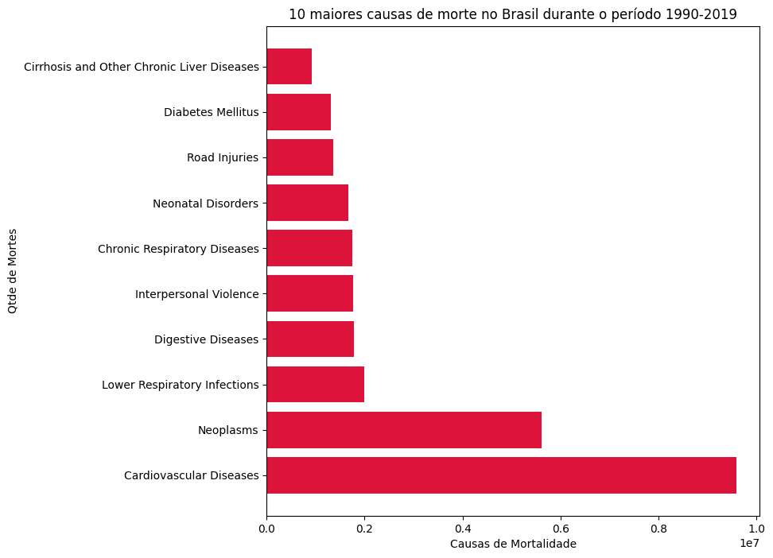

# Análise da relação entre Países e Doenças

A análise realizada aqui tratou de encontrar as maiores causas de morte em todo o mundo, por continente, por país e, de forma mais específica, descobrir quais as 10 maiores causas de morte no Brasil.

## Análise por Continente

- Foi inserida uma nova coluna no dataset para discriminar os 5 continentes, a saber: África, Américas, Ásia, Europa e Oceania;
- Esse dado foi inserido utilizando-se um dataset externo, denominado *'gapminder.tsv'*;
- Nem todos os países presentes na base de dados original tinham correspondente no dataset externo, de modo que cerca de 30% dos dados da coluna **Continent** é *NaN*;
- Utilizou-se o método *groupby()* para sintetizar os dados por continente e depois disso foi usado o método *sum()* para encontrar o somatório dos valores durante o período 1990 a 2019;
- Finalmente, utilizou-se o método *idxmax()* para determinar quais doenças possuiam a maior quantidade de mortes durante o período citado para cada continente.

## Análise por País

- Utilizou-se o método *groupby()* para sintetizar os dados por País/Território e depois disso foi usado o método *sum()* para encontrar o somatório dos valores durante o período 1990 a 2019;
- Finalmente, utilizou-se o método *idxmax()* para determinar quais doenças possuiam a maior quantidade de mortes durante o período citado para cada país.

## Análise dos dados do Brasil

- No dataset original, foram selecionados apenas os dados referentes ao Brasil utilizando-se o esquema de índices explícito - método *iloc()*;
- Foi aplicado o método *sum()* para obter o somatório das mortes por causa específica durante o período 1990 a 2019;
- Em seguida, foi utilizado o método de ordenação de valores *sort_values()* e extraiu-se os 10 valores mais relevantes;
- Por fim, foi gerado um gráfico contendo os dados das 10 maiores causas de morte no país: 

